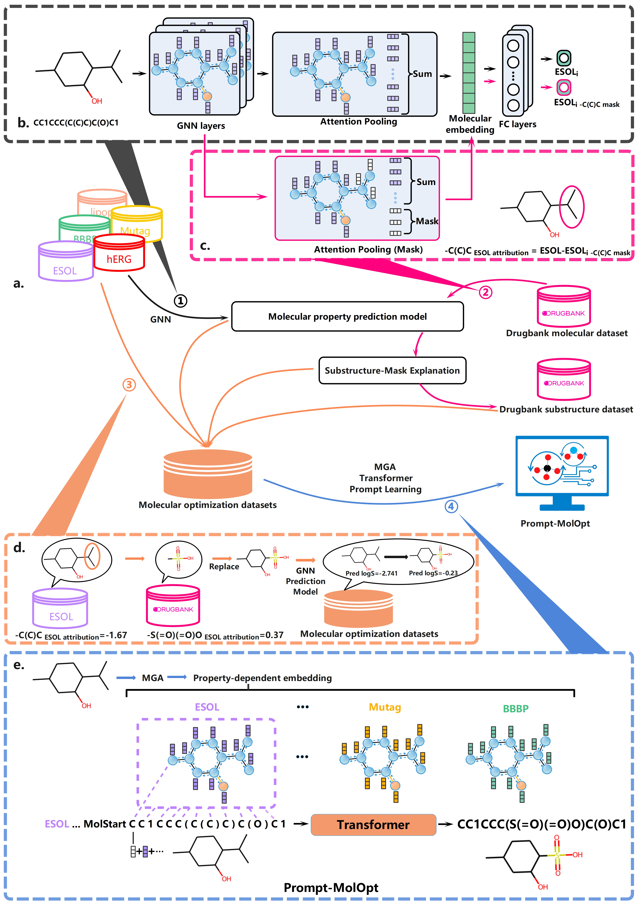

# Prompt-MolOpt: **Leveraging Language Model for Advanced Multi-Property Molecular Optimization via Prompt Engineering**

## Contents

- Overview

- Software Requirements

- Installation Guide

- The construction of Prompt-MolOpt

- Demo: Molecular optimization Case study

  

## Overview

Prompt-MolOpt is a transformative molecular optimization tool based on the Transformer architecture, designed to address the challenges of multi-property optimization in molecular design. Utilizing the Substructure-Mask Explanation method (SME), it generates domain-specific training datasets for any predictable property, laying the groundwork for its advanced optimization capabilities. The tool incorporates property-specific atomic node embeddings generated by Multi-Graph Attention neural networks (MGA), enabling precise targeting of molecular properties. A key feature of Prompt-MolOpt is its use of prompts during the optimization process, guiding the model to focus on specific properties through the integration of these embeddings into atomic tokens. Demonstrating significant advancements over existing methods, Prompt-MolOpt excels in few-shot and zero-shot learning scenarios, aligning well with real-world applications. Additionally, a specialized variant, Prompt-MolOptP, has been developed to preserve essential pharmacophores, further enhancing its applicability in molecular optimization. The model's effectiveness in practical scenarios, particularly in multi-objective structural optimization, highlights its potential as a versatile tool across various fields, extending beyond drug discovery. Prompt-MolOpt's comprehensive approach and successful real-world applications mark it as a notable advancement in the field of molecular optimization.



<center>Figure 1. The construction Process of Prompt-MolOpt.</center>

## Software Requirements

### OS Requirements

The package development version is tested on *Linux: Ubuntu 20.04* operating systems.

### Python Dependencies

Dependencies for Prompt-MolOpt:

```
python==3.6.13
scikit-learn==0.21.3
rdkit==2020.09.1.0
pytorch==1.6.0
dgl==0.7.1
seaborn=1.5.2
numpy
pandas
```


## Installation Guide

### download this repo

```
git clone https://github.com/wzxxxx/Prompt-MolOpt.git
```

Given the large size of the codebase, cloning via Git may be interrupted. Alternatively, consider downloading the ZIP file from the website and extracting it for use.

### install Prompt-MolOpt env

you can install the env via yaml file

```
cd Prompt-MolOpt
conda env create -f PromptMOlOpt.yaml
```

or you can download the [conda-packed file](https://drive.google.com/file/d/1LJ8QzyI2bHxbZGfuXhlHNMnrKHJAcJbr/view?usp=sharing), and then unzip it in `${anaconda install dir}/anaconda3/envs`. `${anaconda install dir}` represents the dir where the anaconda is installed. For me, ${anaconda install dir}=/root .

```
mkdir ${anaconda install dir}/anaconda3/envs/Prompt-MolOpt 
tar -xzvf Prompt-MolOpt.tar.gz -C ${anaconda install dir}/anaconda3/envs/Prompt-MolOpt
conda activate Prompt-MolOpt
```


## The construction of Prompt-MolOpt

Assume that the project is at `/root` and therefore the project path is `/root/Prompt-MolOpt`.

As shown in Figure 1, the construction process of Prompt-MolOpt can be divided into four steps:

### 1. **Building Molecular Property Prediction Models**

Initially, models for predicting molecular properties is constructed using molecular property datasets. The molecular property datasets, code, and models can be found in  [wzxxxx/Substructure-Mask-Explanation: structure-based explanation methods (github.com)](https://github.com/wzxxxx/Substructure-Mask-Explanation) .

### 2. **Creating Molecular Optimization Datasets**

Here, we'll explain how to construct molecular optimization pairs using Substructure Mask Explanation (SME), Drugbank datasets, and a molecular property dataset through the `/root/Prompt-MolOpt/SME_opt/Molecular_optimized_pair_generator.ipynb` script. Ultimately, the molecular pair dataset created for ADMET property optimization will be stored as `/root/Prompt-MolOpt/data/origin_data/mol_opt_data.csv`.

### 3. **Developing MGA models to generate property-related atomic token embeddings**

A multi-task molecular property prediction model is developed utilizing the molecules from the training molecular pairs. The molecules with prediction values in the training molecular pairs are random split into training, validation, and test sets .

(`/root/Prompt-MolOpt/data/origin_data/ADMET_data_for_MGA.csv`) . These molecules are  utilized for the construction of the Multi-Graph Attention (MGA) model, and the MGA model are designed to generate property-related atomic token embeddings. Build the MGA models:

```
cd /root/Prompt-MolOpt/mga_utils
python build_graph_dataset.py --task_name ADMET_data_for_MGA
python Main.py --task_name ADMET_data_for_MGA
```

The generated models are saved at /root/Prompt-MolOpt/checkpoints/mga

### 4. **Constructing the Prompt-MolOpt Model**

```
cd /root/Prompt-MolOpt/mga_utils
# generate datasets for Prompt-MolOpt, and the datasets are saved in /root/Prompt-MolOpt/preprocessed
python mol_opt_data_mga_generate.py 
# train the Prompt-MolOpt Model
sh Prompt_molopt_train.sh
```

Finally, utilizing the molecular optimization dataset and the property-related atom representations, the Prompt-MolOpt model is built. Different scripts are used to develop different versions of Prompt-MolOpt model.


## Demo: Molecular optimization Case study

Assume that the project is at `/root` and therefore the project path is /root/Prompt-MolOpt.

### 1. Generate the preprocessed data.

The source data is in the /root/Prompt-MolOpt/data/hERG_BBBP_case_study_test_0.csv. First, generate the preprocessed data for Prompt-MolOptP.

```
cd /root/Prompt-MolOpt/mga_utils
python mol_opt_data_remark_mga_generate_test.py
```

 It will transform the molecule to three component as follows: Prompt tokens, Pharmacophore and the fragments for optimization.


### 2. Generate optimized molecules.

The purpose of this step is generate optimized molecules. The outcome, including the optimized molecules, will be saved in `/root/Prompt-MolOpt/PromptP_molopt_hERG_BBBP_case_study_result.csv`, which should match the contents of `PromptP_molopt_hERG_BBBP_case_study_result_demo.csv`. 

```
cd /root/Prompt-MolOpt
python predict_prompt_hERG_BBBP_case_study.py
```

The above steps help to replicate the results of case study reported in the study.

### 3. Visualization of the result

To visualize the optimized molecules, you should run the provided Jupyter notebook located at `/root/Prompt-MolOpt/result/PromptP-Molopt-hERG-BBBP-case-study-visual.ipynb`. A pre-run version of this notebook has already been provided for reference. 

### 4. Replicating Study Results

To replicate the results reported in the paper, the necessary data and code to reproduce these findings are provided in the `/root/Prompt-MolOpt/result` directory.
