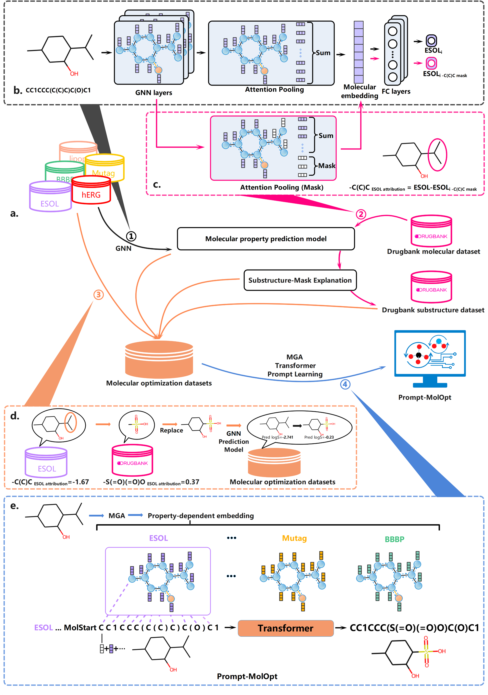

# Prompt-MolOpt
Prompt-MolOpt is a transformative molecular optimization tool based on the Transformer architecture, designed to address the challenges of multi-property optimization in molecular design. Utilizing the Substructure-Mask Explanation method (SME), it generates domain-specific training datasets for any predictable property, laying the groundwork for its advanced optimization capabilities. The tool incorporates property-specific atomic node embeddings generated by Multi-Graph Attention neural networks (MGA), enabling precise targeting of molecular properties. A key feature of Prompt-MolOpt is its use of prompts during the optimization process, guiding the model to focus on specific properties through the integration of these embeddings into atomic tokens. Demonstrating significant advancements over existing methods, Prompt-MolOpt excels in few-shot and zero-shot learning scenarios, aligning well with real-world applications. Additionally, a specialized variant, Prompt-MolOptP, has been developed to preserve essential pharmacophores, further enhancing its applicability in molecular optimization. The model's effectiveness in practical scenarios, particularly in multi-objective structural optimization, highlights its potential as a versatile tool across various fields, extending beyond drug discovery. Prompt-MolOpt's comprehensive approach and successful real-world applications mark it as a notable advancement in the field of molecular optimization.

**requirements:** python==3.6.13, scikit-learn==0.21.3, rdkit==2020.09.1.0, pytorch==1.6.0, dgl-cuda10.1==0.7.0, seaborn=1.5.2, numpy pandas

The datasets, models and prediction

The trained model, data and results can be download from the following link for reproduction  https://drive.google.com/file/d/1HZaWkHZGx9rwfzikRQqcieJCY0jh2lpw/view?usp=sharing. The environment (linux) for the code can be downloaded from the following link: https://drive.google.com/file/d/1HZaWkHZGx9rwfzikRQqcieJCY0jh2lpw/view?usp=sharing.
